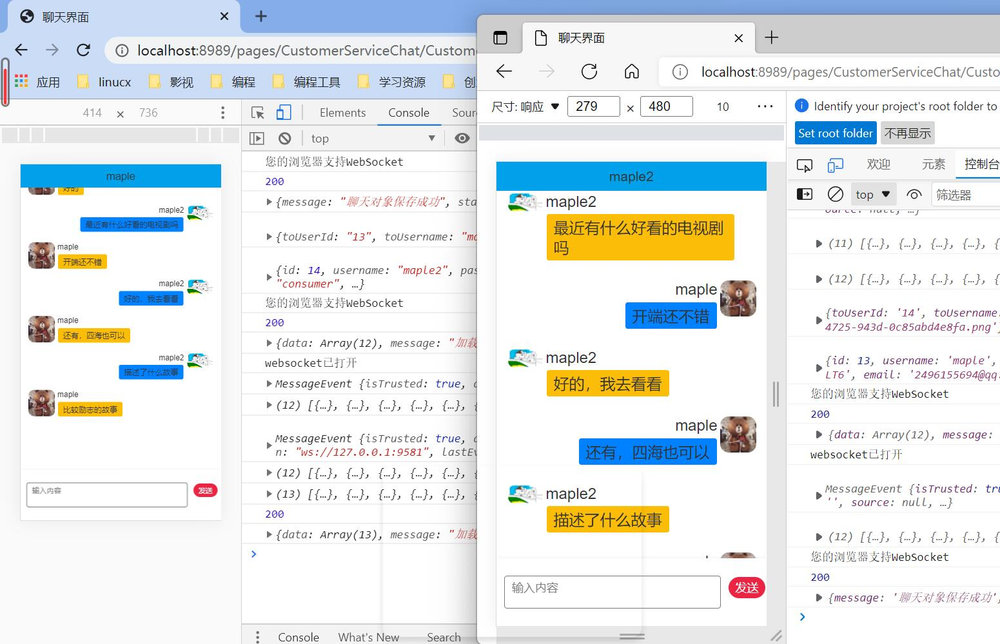
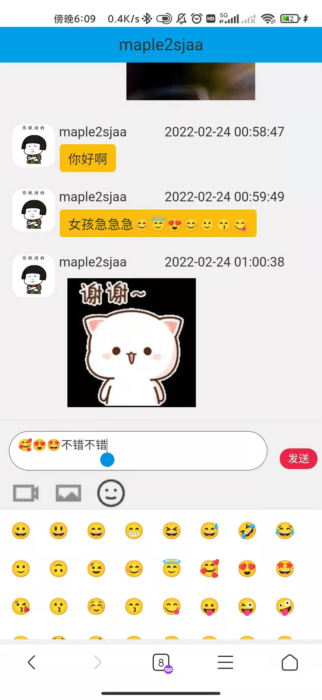
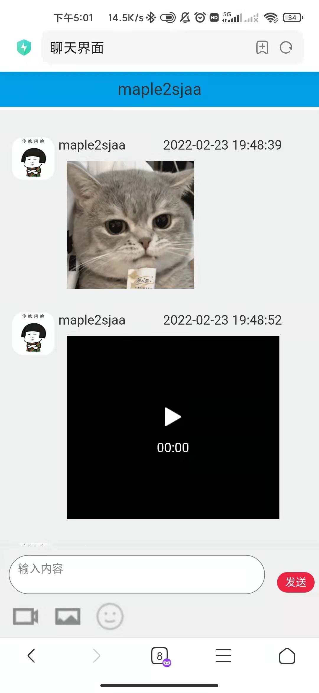
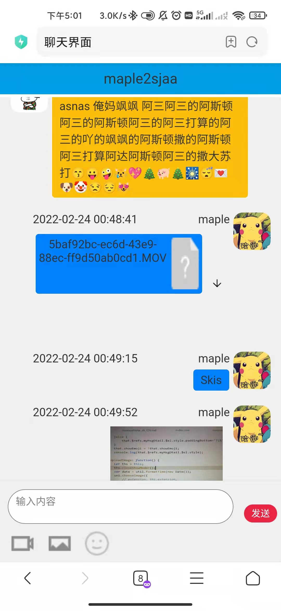
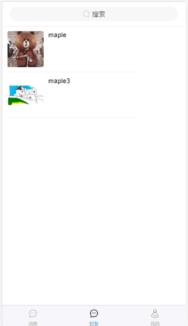
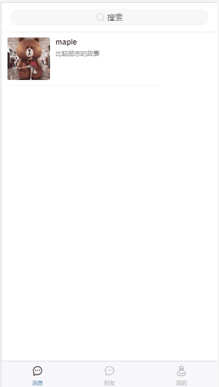

# qq-chat-project

#### 介绍
##### 最新版gitee地址：https://gitee.com/hongmaple/qq-chat-project
使用uniapp+java实现的聊天软件，用redis存储聊天数据，实现离线消息推送，使用邮箱注册，邮箱验证来实现用户注册，即时渲染聊天数据，加载聊天列表，支持离线（对方离线）消息发送,目前支持文件发送下载，图片视频发送与展示，以及表情包功能，并加入了时间的显示和聊天列表关于多种类型消息的简述，用户名，用户头像实时更新
##### 部分截图

#### 软件架构
软件架构说明

前端：uniapp

后端：java+springboot+redis+mysql+jwt

环境：JDK1.8

#### 安装教程

1.  创建并导入数据库（qqchat）qq-chat-project/qqchat/sql/qqchat.sql 
2.  打开idea导入qqchat 下载依赖
3.  修改配置文件，配置mysql连接，redis连接，文件上传地址，rsa密钥地址
4.  运行后端服务
5.  打开HBuilder X导入qqchat-uniapp 点击左上方运行到本地浏览器

#### 使用说明

1.  表情包管理，qq-chat-project\qqchat-uniapp\utils\constant.js  修改emojiJson
2.  请求封装 \qq-chat-project\qqchat-uniapp\utils\http.js
3.  邮件配置 \qq-chat-project\qqchat\src\main\resources\email.properties

#### 参与贡献

1.  Fork 本仓库
2.  新建 Feat_xxx 分支
3.  提交代码
4.  新建 Pull Request

#### 特技

1.  使用 redis来存储聊天数据
2.  使用邮箱注册，邮箱验证来实现用户注册
3.  即时渲染聊天数据，加载聊天列表，支持离线（对方离线）消息发送
4.  使用rsa对token进行加密，提高安全性

## 联系我，提供部署定制服务
wx: mapleCx330   qq群： 

## 开源不易，谢谢打赏
<table>
 <td>
   <td></td>
   <td></td>
 </td>
</table>
